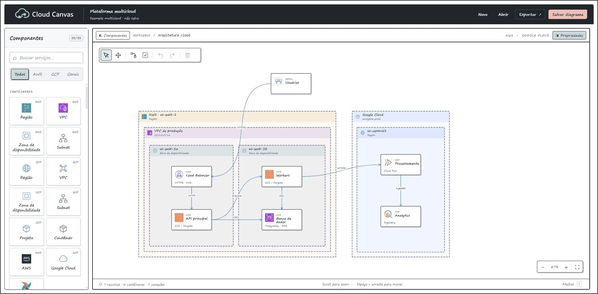

# Cloud Canvas

<p align="center">
  <picture>
    <source media="(prefers-color-scheme: dark)" srcset="static/brand/cloud-canvas-logo-dark.svg">
    <source media="(prefers-color-scheme: light)" srcset="static/brand/cloud-canvas-logo.svg">
    
  </picture>
</p>

Editor visual de arquiteturas cloud e fluxos de dados, com **Flask, JavaScript nativo e SVG**. Monte diagramas AWS, Google Cloud e de tecnologias como Oracle, MariaDB, Kafka e Airflow no navegador. Funciona localmente, sem provisionar infraestrutura.

## Exemplo da aplicação



## Recursos

- Biblioteca pesquisável com serviços cloud, bancos e fontes externas, incluindo API.
- Contêineres aninhados, seleção múltipla, guias de alinhamento e redimensionamento.
- Conexões curvas, retas ou ortogonais, quatro cores e linhas contínuas, tracejadas ou pontilhadas.
- Pontas de seta opcionais na origem e no destino e escolha dos lados de entrada e saída.
- Texto livre e blocos de notas com várias linhas, alinhamento e edição direta por dois cliques.
- Desfazer/refazer, salvamento local e exportação em JSON, SVG e PNG.
- Exemplo de arquitetura multicloud.

## Executar

Requer **Python 3.10 ou superior**. Node.js não é necessário para executar.

### Windows / PowerShell

```powershell
git clone https://github.com/RafaelPompeu/cloud-canvas.git
cd cloud-canvas
python -m venv .venv
.\.venv\Scripts\python.exe -m pip install -r requirements.txt
.\.venv\Scripts\python.exe app.py
```

Depois de instalar as dependências, também é possível iniciar com `./run.ps1`.

### Linux / macOS

```bash
git clone https://github.com/RafaelPompeu/cloud-canvas.git
cd cloud-canvas
python3 -m venv .venv
.venv/bin/python -m pip install -r requirements.txt
.venv/bin/python app.py
```

Abra **http://127.0.0.1:5000**. Pressione **Ctrl+C** no terminal para encerrar. A variável de ambiente `PORT` permite escolher outra porta.

## Como usar

1. Ao abrir a aplicação, o canvas começa em branco. Em **Novo**, você também pode escolher um exemplo explicitamente.
2. Busque componentes e clique para adicionar ou arraste para o canvas.
3. Organize os recursos nos contêineres. **Alt + arraste** ou **Dentro de** troca o contêiner.
   O painel de Propriedades começa recolhido para liberar espaço no canvas. Clique nas barrinhas laterais para ocultar ou reabrir Componentes e Propriedades.
4. Ative **Conectar (C)** e clique na origem e no destino. Selecione a linha para editar cor, traçado, estilo, pontas e lados.
   Selecione uma seta curva ou ortogonal e arraste seu ponto de ajuste para mudar o trajeto. Arraste o rótulo ao longo da linha para reposicioná-lo. **Esc** cancela o arraste; desfazer/refazer e o arquivo JSON preservam esses ajustes. Nas Propriedades, **Restaurar trajeto e texto** retorna à posição automática.
5. Use **Adicionar texto**, com ícone T, na barra do canvas ou procure **Texto** e **Bloco de notas** na biblioteca. O botão **Adicionar emoji** abre um seletor com 16 desenhos de traço à mão, também usados nos emojis de diagramas já salvos. A caixa de texto ou emoji acompanha as medidas do conteúdo, sem área vazia; arrastar o canto redimensiona o conteúdo proporcionalmente. Textos usam quebras de linha explícitas. Dois cliques permitem escrever no elemento. **Enter** insere uma linha, clicar fora aplica e **Esc** cancela. **Ctrl+Enter** também aplica.
6. **Abrir** mostra o seletor de arquivos do computador: escolha um diagrama `.json` exportado pelo Cloud Canvas. **Salvar diagrama** e **Ctrl+S** baixam um arquivo JSON na máquina de quem usa o editor. Cada salvamento gera um download; a pasta e a confirmação dependem das configurações do navegador.
7. Em **Exportar**, escolha JSON editável, SVG ou PNG. As imagens incluem o diagrama e seus logos, sem controles de edição.

Textos e notas aceitam até 2.000 caracteres. Aumente o elemento para mostrar conteúdos longos. Segure **Shift** ao mover ou redimensionar para encaixar nas guias. **Agrupar** organiza filhos do contêiner selecionado quando há espaço.

O PNG amplia a resolução até 2×, limitado a 8.192 pixels por lado e 16 megapixels. SVG e PNG usam o tema do canvas. A fonte do SVG em outro computador depende de sua disponibilidade; o PNG preserva a renderização do computador que exportou.

### Atalhos

| Ação | Atalho |
| --- | --- |
| Selecionar / mover canvas / conectar | V / H / C |
| Mover canvas temporariamente | Espaço + arraste |
| Enquadrar / zoom | F / roda do mouse |
| Selecionar todos | Ctrl+A |
| Adicionar ou remover da seleção | Shift + clique |
| Salvar | Ctrl+S |
| Desfazer / refazer | Ctrl+Z / Ctrl+Shift+Z |
| Excluir / cancelar | Delete / Esc |
| Ver atalhos | ? |

## Dados locais

Os diagramas são guardados em arquivos `.json` no computador da pessoa. Use **Salvar diagrama** para baixar e **Abrir** para selecionar um arquivo. O navegador pode perguntar onde salvar ou usar a pasta de downloads. Confirme que o download terminou antes de fechar a página. O salvamento não envia o diagrama ao servidor. A abertura envia o JSON ao servidor apenas para validação, sem persistência.

Bancos SQLite de versões anteriores são preservados e acessados somente para leitura por links antigos com `?diagram=...`. Abra esses diagramas e clique em **Salvar diagrama** para obter o JSON. A aplicação não cria bancos nem aceita novas gravações neles.

O editor foi projetado para uso local individual: escuta em `127.0.0.1`, sem autenticação ou edição colaborativa. Publicar o código no GitHub não hospeda a aplicação.

## Publicar no Render

O repositório inclui `render.yaml` para um Web Service no plano **Free**, servido por Gunicorn. No [painel do Render](https://dashboard.render.com), escolha **New > Blueprint**, conecte este repositório, selecione a branch com esse arquivo e confira o plano Free antes de criar o serviço.

Para configurar por **New > Web Service**, use:

| Campo | Valor |
| --- | --- |
| Language | Python 3 |
| Build Command | `pip install -r requirements.txt` |
| Start Command | `gunicorn --bind 0.0.0.0:$PORT --workers 1 --threads 4 --forwarded-allow-ips='*' --access-logfile - 'app:create_app()'` |
| Instance Type | Free |
| Health Check Path | `/api/health` |

Após o deploy, `/api/health` deve responder `{"status":"ok"}`. O comando usa a fábrica `create_app()`; este projeto não expõe uma variável global `app`.

O parâmetro `--forwarded-allow-ips='*'` permite que o Gunicorn reconheça o HTTPS informado pelo proxy do Render, mantendo a validação de origem ao salvar. Use esse comando somente atrás do proxy da plataforma; não exponha diretamente essa configuração de Gunicorn à internet.

**Armazenamento:** tanto localmente quanto no Render, **Salvar diagrama** baixa o JSON no computador da pessoa. Os arquivos salvos não dependem do armazenamento do servidor.

**Dados antigos:** não publique um banco SQLite anterior no Render; as rotas de compatibilidade permitem consultar seu conteúdo sem autenticação.

## Estrutura

| Arquivo | Responsabilidade |
| --- | --- |
| app.py | API Flask, validação e leitura de bancos antigos |
| templates/index.html | Estrutura da interface |
| static/app.js | Interações, propriedades, edição e exportações |
| static/graph.mjs | Modelo, geometria e hierarquia |
| static/alignment.mjs | Guias e encaixes |
| static/selection.mjs | Seleção múltipla |
| static/catalog.json | Catálogo de componentes |
| static/catalog.mjs | Busca e filtros |
| static/icons.mjs e static/icons/ | Carregamento, logos e fontes |
| static/styles.css e static/sketch.css | Estilos base e tema |
| static/example.json | Exemplo multicloud |
| run.ps1 | Inicialização no Windows |
| tests/ | Testes da API e persistência |
| AGENTS.md | Orientações para manutenção |

## Desenvolvimento

```powershell
.\.venv\Scripts\python.exe -m unittest discover -s tests -v
```

Em Linux/macOS, use `.venv/bin/python`. Para mudanças visuais, verifique o fluxo no navegador e as exportações afetadas. Leia [AGENTS.md](AGENTS.md) antes de alterar o projeto.

## Ícones e marcas

As marcas pertencem aos respectivos titulares e não indicam afiliação ou patrocínio. As fontes estão em [static/icons/README.md](static/icons/README.md) e nos manifestos dessa pasta. Os desenhos de Oracle e MariaDB têm como referência os símbolos da biblioteca Devicon, conforme o [registro de origem](static/icons/shared/oracle-mariadb-sources.json).

### Conectar componentes

Passe o mouse sobre um recurso ou contêiner e arraste um dos pontos laterais até outro componente. A prévia mostra a curva e destaca o ponto de chegada. Ao soltar, a conexão conserva os lados escolhidos, inclusive ao mover os componentes. Soltar no vazio ou pressionar Esc cancela. A ferramenta Conectar (C) continua permitindo clicar na origem e no destino.
